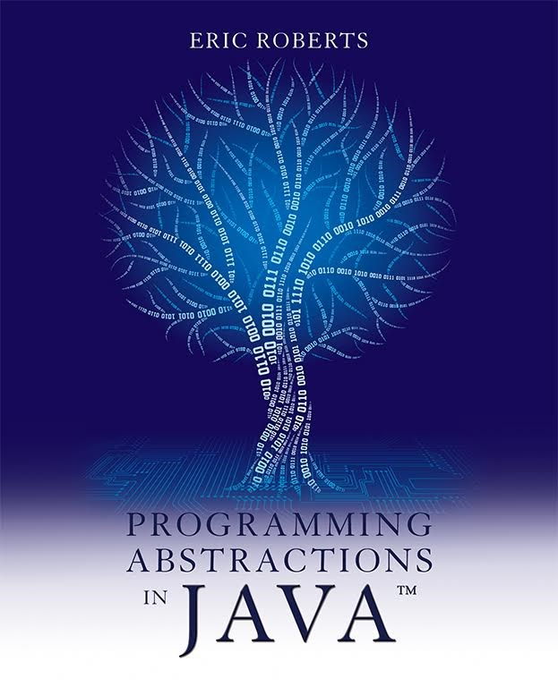

# Source code of Programming Abstractions in Java, 1/E
Source of the book can be downloaded form Pearson Education Inc.'s [website](https://media.pearsoncmg.com/ph/esm/ecs_roberts_paj_1/cw/content/sourcecode.zip)

# Programming Abstractions in Java, 1/E
- Author: Eric Roberts
- ISBN-10: 0134421183
- ISBN-13: 9780134421186

# Java程序设计——基础、编程抽象与算法策略
- 作者: (美)埃里克S.罗伯茨
- 译者: 陈昊鹏
- 出版社: 机械工业出版社
- 出版年: 2017-09-01
- 页数: 542
- 定价: ￥99.0
- 丛书: 计算机科学丛书
- ISBN: 9787111578277
